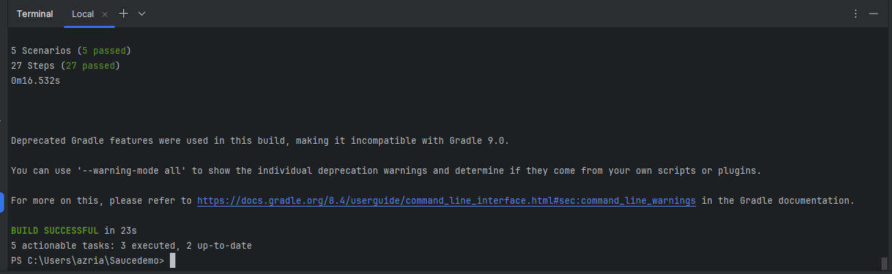

Automation Web of Saucedemo.com

This automation using Selenium Cucumber with Gherkin in Java programming language

Features:
1. Login
   - Login with a valid credential
   - Login with an invalid credential 
2. Checkout
   - Add product to cart
   - Finish the checkout process
3. Logout

To execute all features, run the class on CucumberTest file or run the workflows manually.

Execute Result:
